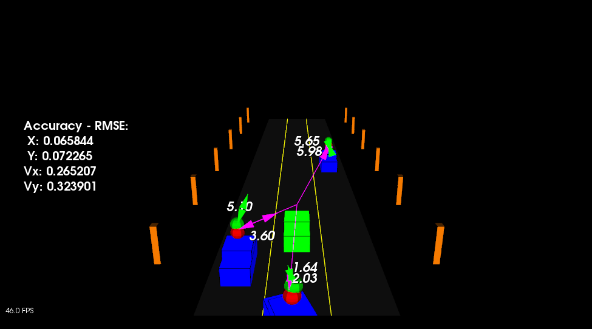

# **Unscented Kalman Filter Highway Project** 
---

**Unscented-Kalman-Filter-Project**

The goals / steps of this project are the following:
* Implement an Unscented Kalman Filter using noisy lidar and radar measurements.
* Implement function ProcessMeasurement
* Implement function Prediction
* Implement function UpdateLidar
* Implement function UpdateRadar
* Obtaine RMSE values to evaluate performance and to keep it within threshold

## Rubric Points
### Here I will consider the [rubric points](https://review.udacity.com/#!/rubrics/2551/view) individually and describe how I addressed each point in my implementation.  

---
### Compiling and Testing

#### 1. The submission must compile.

The project code compiled without errors using cmake and make.

### Code Efficiency

#### 1. The methods in the code should avoid unnecessary calculations.

The methods in the code avoided unnecessary calculations like running the exact same calculation repeatedly, by running it once, storing the value and then reusing the value later.
For example, weights of sigma points were calculated once (file : ukf.cpp; lines : 77-84) and used multiple times in the same file in different functions (file : ukf.cpp; lines : 246; 268; 299, 321, ...).

### Accuracy

#### 1. px, py, vx, vy output coordinates must have an RMSE <= [0.30, 0.16, 0.95, 0.70] after running for longer than 1 second.

The simulation collected the position and velocity values that my algorithm produced and they were compared to the ground truth data. My px, py, vx, and vy RMSE were less than or equal to the values [0.30, 0.16, 0.95, 0.70] after the simulator ran for longer than 1 second. The simulator also displayed if RMSE values surpassed the threshold, especially while fine-tuning the hyperparameters.

##### Output image with low RMSE within threshold value (near beginning of simulation)

  

##### Output image with high RMSE within threshold value (near end of simulation)

  

### Follows the Correct Algorithm

#### 1. Your Sensor Fusion algorithm follows the general processing flow as taught in the preceding lessons.

There was a well-defined set of steps that took place in order to successfully build a Kalman Filter. It followed the algorithm as described in the preceding lesson. The steps followed were,

* Initialized Unscented Kalman filter
* Defined measurement noise values for sensor manufacturer

##### ProcessMeasurement
* Initialized range, bearing, velocity
* calculated dt in seconds
* Implemented Prediction step
* Updated step for Radar
* Updated step for Lidar

##### Prediction
* created augmented mean vector
* created augmented state covariance
* Created augmented sigma points matrix
* created augmented mean state
* created augmented covariance matrix
* created square root matrix
* created augmented sigma points
* predict sigma points
* extracted values for better readability
* predicted state values
* avoided division by zero
* added noise
* predicted sigma point into right column
* predicted state mean
* iterated over sigma points
* predicted state covariance matrix
* iterated over sigma points
* calculated state difference
* calculated angle normalization
* updated state covariance matrix

##### UpdateLidar
* extracted measurement
* created matrix for sigma points in measurement space
* transformed predicted sigma points matrix into measurement space
* calculated mean predicted measurement
* calculated predicted measurement covariance matrix
* calculated residual
* calculated angle normalization
* updated predicted measurement covariance matrix
* added measurement noise covariance matrix for lidar
* created matrix for cross correlation matrixc between sigma points in state space and measurement space
* calculated cross correlation matrix
* calculated residual
* calculated angle normalization
* calculated state difference
* calculated angle normalization
* updated cross correlation matrix
* calculated Kalman gain K
* calculated residual
* calculated angle normalization
* updated state mean and covariance matrix
* calculated NIS for lidar

##### UpdateRadar
* same as above
